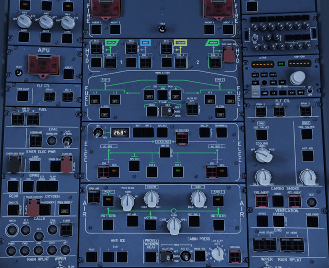

This changes the Laminar Research Airbus A330-300 overhead panel state to something more like the ToLiss A340-600 uses for a cold & dark startup.

## Optional Features
### Set PFD, ND, ECAM and MCDU panels to low brightness
If you don't want this feature, don't copy the following folder to your xLua scripts folder or remove it afterwards.
```
A333.Z.coldstart_low_display_brightness
```

### Sync display brightness between Captain and FO side
If you don't want this feature, don't copy the following folder to your xLua scripts folder or remove it afterwards.
```
A333.Z.sync_display_brightness_settings
```

### Sync EFIS Baro setting and mode between Captain and FO side
If you don't want this feature, don't copy the following folder to your xLua scripts folder or remove it afterwards.
```
A333.Z.sync_efis_baro_settings
```

### Sync EFIS FD and LS mode between Captain and FO side
If you don't want this feature, don't copy the following folder to your xLua scripts folder or remove it afterwards.
```
A333.Z.sync_efis_fd_ls_settings
```
